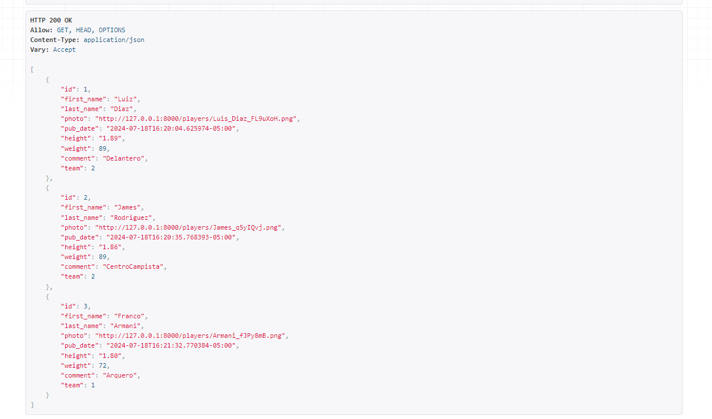
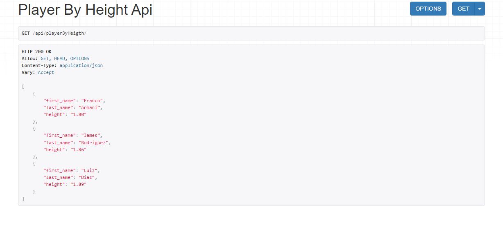
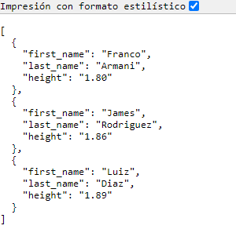

# Añadir API a nuestro Proyecto

1. Django REST Framework : ```python -m pip install djangorestframework```

2. Poner la aplicación en nuestro settings.py
```python
# django_project/settings.py
INSTALLED_APPS = [
    'adminlte3',
    'adminlte3_theme',
    'django.contrib.admin',
    'django.contrib.auth',
    'django.contrib.contenttypes',
    'django.contrib.sessions',
    'django.contrib.messages',
    'django.contrib.staticfiles',
    "rest_framework", # new
    'album',
]
```
3. Crear una modulo que lo llamaremos apis ```python manage.py startapp apis ```

    Agregar la app
    ```python
    # django_project/settings.py
    INSTALLED_APPS = [
        'adminlte3',
        'adminlte3_theme',
        'django.contrib.admin',
        'django.contrib.auth',
        'django.contrib.contenttypes',
        'django.contrib.sessions',
        'django.contrib.messages',
        'django.contrib.staticfiles',
        "rest_framework", # new
        'album',
        "apis.apps.ApisConfig", # new
    ]
    ```
## Agregar las herramientas necesarias para activar rest_framework
    
1. Importar la biblioteca serializers este modelo traduce la información de la base en información mas facil de consumir tipicamente JSON.
```python
from rest_framework import serializers
from album.models import Player

class PLayerSerializer(serializers.ModelSerializer):
    class Meta:
        model = Player
        fields = '__all__'

class PLayerSerializerByheight(serializers.ModelSerializer):
    class Meta:
        model = Player
        fields = ['first_name','last_name','height']
```
2. Añadimos la Vista la cual le vamos a pasar el objeto en queryset y en el parametro serualizer_class enviamos el modelo y los campos que queremos ver
```python
from rest_framework import generics
from album.models import Player
from .serializers import PLayerSerializer, PLayerSerializerByheight

class PlayerAPIView(generics.ListAPIView):
    queryset = Player.objects.all()
    serializer_class = PLayerSerializer

class PlayerByHeightAPIView(generics.ListAPIView):
    queryset = Player.objects.all().order_by('height')
    serializer_class = PLayerSerializerByheight 
```
3. Añadimos las rutas de nuestra api y en nuestro proyecto principal


```python
#apis/urls
from django.urls import path
from .views import PlayerAPIView,PlayerByHeightAPIView

urlpatterns = [
    path("", PlayerAPIView.as_view(), name="api-player-list"),
    path("playerByHeigth/", PlayerByHeightAPIView.as_view(), name="api-player-list-height"),
]
```
```python
#copa_america/urls
from django.contrib import admin 
from django.urls import path, include 
from album import views

urlpatterns = [
    path('admin/', admin.site.urls, name='administrador'),
    path('',views.TeamListView.as_view(), name='team-list'),
    path("api/", include("apis.urls")),
    path('album/',include("album.urls")),
]
```
Posteriormente Probamos Nuestro projecto

1. http://127.0.0.1:8000/api/

Nos llevara a la vista de todos los jugadores


2. http://127.0.0.1:8000/api/playerByHeigth/

Nos lleva a la lista ordenada donde nos va a dar solo los campos 
fields = ['first_name','last_name','height']



3. http://127.0.0.1:8000/api/playerByHeigth/?format=json

Obtenemos el resultando solo en json



## TODO API

